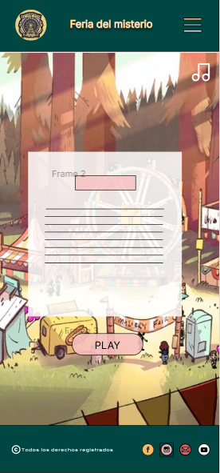
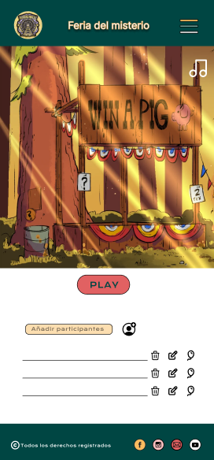
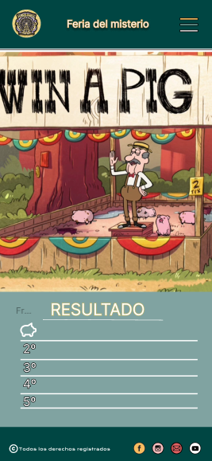

# LA FERIA DEL MISTERIO  🎪🎈

## DESCRIPCIÓN DEL PROYECTO 📓


¡Bienvenido a la Feria del Misterio!
¿Estás listo para sumergirte en la emoción de nuestro reto? 

La Feria del Misterio es un juego desarrollado en TypeScript que te sumerge en la emocionante experiencia de una feria misteriosa donde los globos no son solo para explotarlos, ¡Si ganas te llevas un cerdito! 🤩

<p align="center">
  
</p>


## DISEÑO DE LA WEB CON FIGMA
### LAPTOP 💻
<div style="display: flex; flex-direction: column; align-items: center;>
    
    
    
    
</div>

### MOBILE 📱

<div style="display: flex; flex-direction: column; align-items: center;>
    
    
    
    
</div>

## USER FLOW
<div>
    
</div>
<br>
## LENGUAJES UTILIZADOS :rocket:

<div>
    &nbsp;
        &nbsp;
    &nbsp;

</div>


## HERRAMIENTAS UTILIZADAS :hammer:
<div>
    &nbsp;
    &nbsp;
    &nbsp;
</div>

## COLABORADORES/AS  :family:

- [Alicia González](https://github.com/Aliglez)
- [Borja Fernández](https://github.com/BarmanDev)
- [David Colunga](https://github.com/Colunga-D)
- [Eva López](https://github.com/EvaMLopez)
- [Rebeca MF](https://github.com/RebecaMFep)
  


## INSTALACIÓN DEL PROYECTO 
```
npm install
npm run dev
```

## PRODUCCIÓN 
```
npm run build
npm run preview
```
